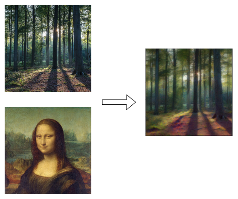
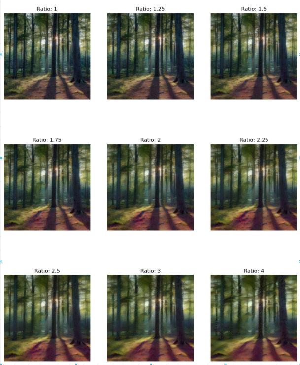
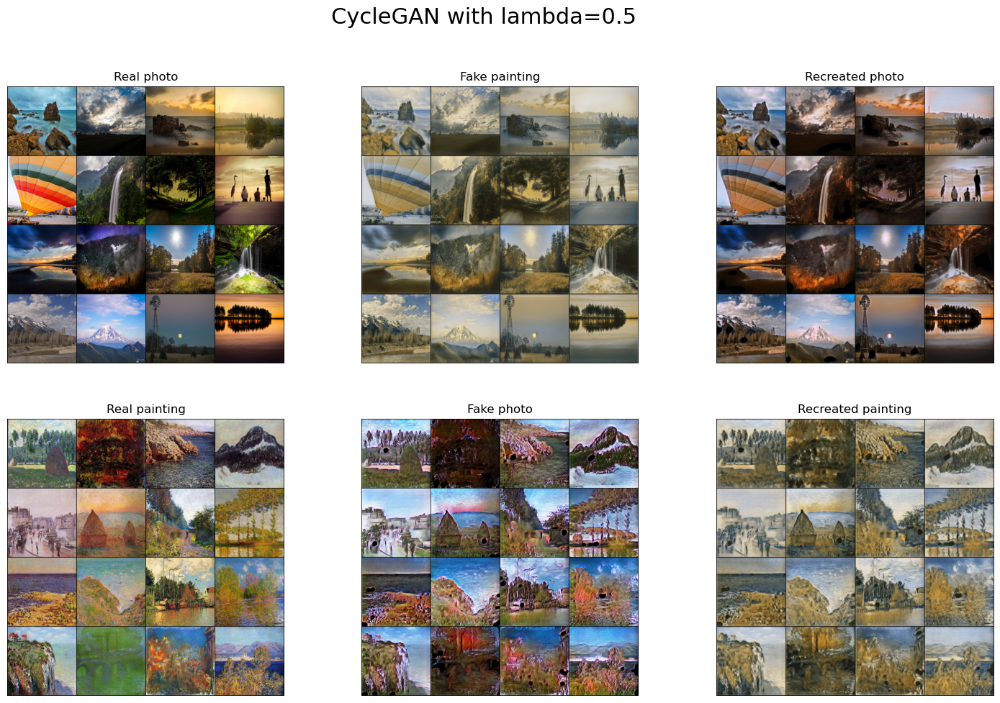
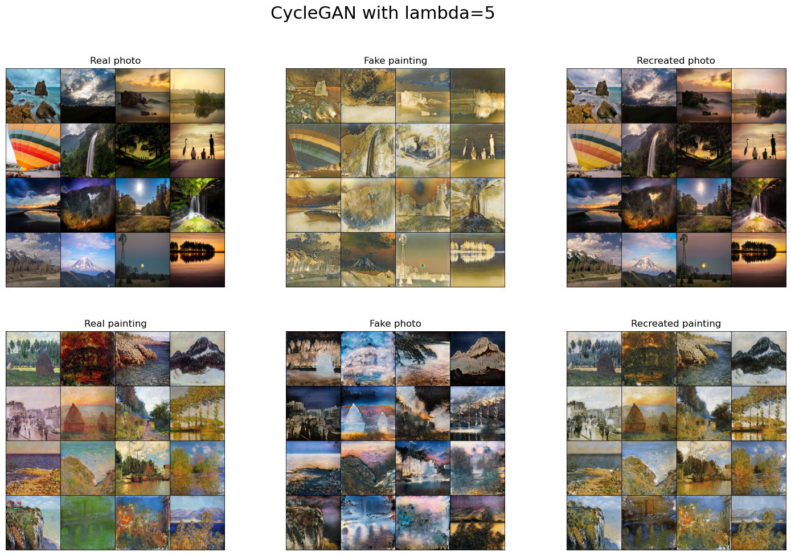
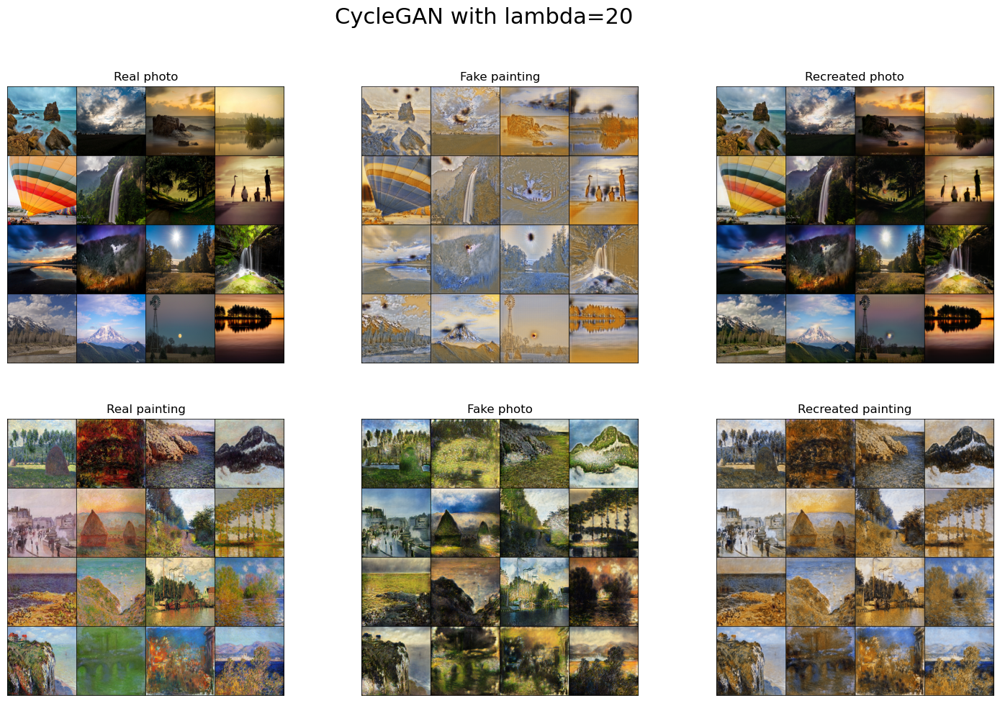
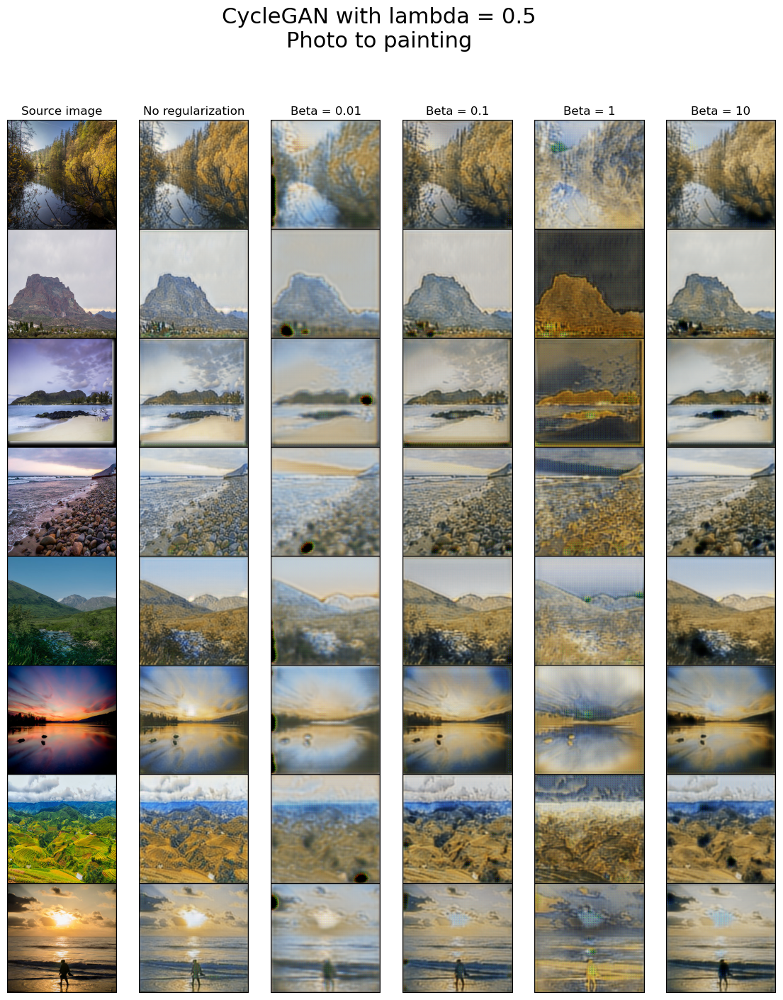
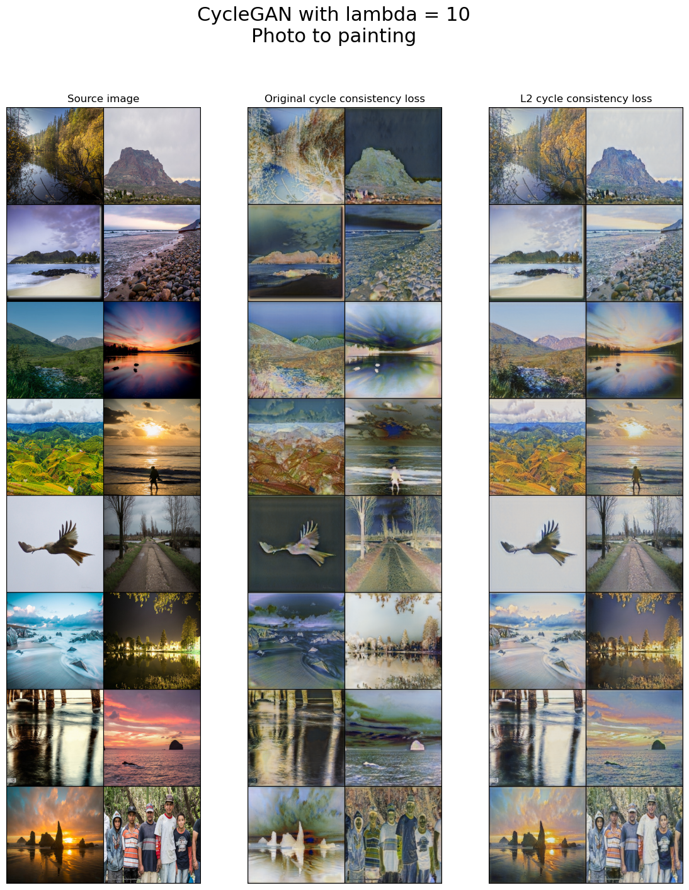

# Take control of your style - WUT-24L-ZPRP 
- [Project Description](#Description and experiments)
- [Setup](#setup)
- [Contribution](#contributing)

## Description and experiments
## What is style transfer?
This project explores concept of style transfer in computer vision using python. Idea was proposed by [L. Gatys](https://arxiv.org/abs/1508.06576)
to apply the stylistic elements of one image are applied to the content of another image, creating a unique blend of both like below:



One of them main issues is fact images preserved content but don't resemble given style or are significantly styled but
content is disported. To address this issue we prosed parameter to loss function

$$\mathcal{L}_{total} = \alpha \mathcal{L}_{content} + \beta \mathcal{L}_{style}$$

It allows us to control how much do we want style image or preserve content




## Take control of your style

One of the main drawback of such approach is need to train new model for each pair of images.
To tackle this issue we approached implementation of cycleGAN. It aims to perform image-to-image translation tasks 
without requiring paired examples. This is particularly useful for tasks where obtaining paired data is difficult 
or impossible. [CycleGAN](https://arxiv.org/pdf/1703.10593) can learn to translate images from one domain eg. photos to Monet painting or day to night.
To keep ability to control content to style trade-off we incorporated $`\mathcal{lambda}`$ parameter 

$$L(G, F, D_X, D_Y) = \mathcal{L}_{GAN}(G, D_Y, X, Y) + \mathcal{L}_{GAN}(F, D_X, Y, X) + \lambda \mathcal{L}_{cyc}(G, F)$$

which controls importance of part of loss function responsible for similarity to base image. We trained transfer from photos
to Monet painting and vice versa







## How not to collapse?
Main issue with training GAN based models is model collapse, we observed this issue especially for higher values of lambda param, when content is more realistic, however colors are often inverted to address this issue we proposed two methods
- lower lambda and regularization
- L2 instead of L1 distance for cycle consistency loss

Regularization $`\mathcal{beta}`$ to loss function - cosine similarity of source and re-created image - as semantic 
complementary part for pixel-wise cycle consistency loss



Modified loss function 



## Setup

#### Prerequisites  

- Python >=3.11
- `conda`

#### Install

```shell
conda env create --name zprp --file=environment.yml
conda activate zprp
poetry config --local virtualenvs.create false  # make poetry install packages to conda venv
poetry install [--no-dev]
```

This will re-create the conda environment (mostly `pytorch` related dependencies) and install other project deps plus some extra tools - `ruff`, `mypy`, `pytest`, etc. (if `--no-dev` was not passed).

#### Run tests

```shell
poetry run pytest -v
```

## Contributing

**NOTE** - when adding dependencies to the project, try to maximize the use of `poetry` - we don't want to rely on `conda` in anything that is not strictly `pytorch` or CUDA related.


Before submitting a PR:

- 1. Reformat the code

```shell
poetry run ruff format
```

- 2. Lint with `mypy` and `ruff`

```shell
poetry run mypy
```

```shell
poetry run ruff check [--fix]
```

- 3. Run tests as described above.