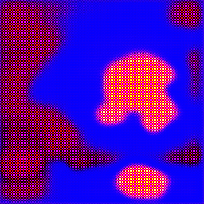

# CycleGAN vs Gatys comparison

## Style and Content images

## Gatys vs Cyclegan results

## Cyclegan details
- lambda parameter: `0, 0.5, 1, 2`

## Gatys detauls
- content loss from `1e-5` to `1e4`
- style loss constant `1e4`